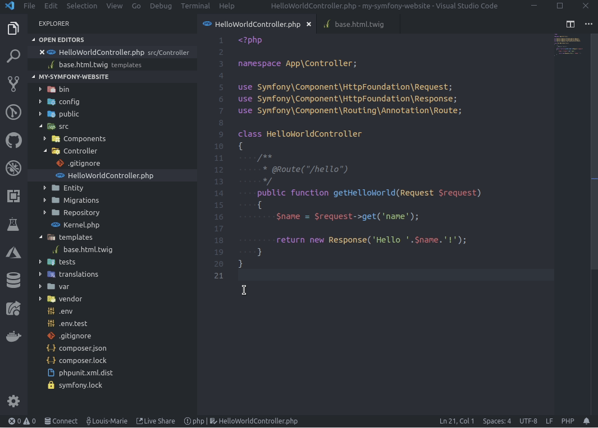
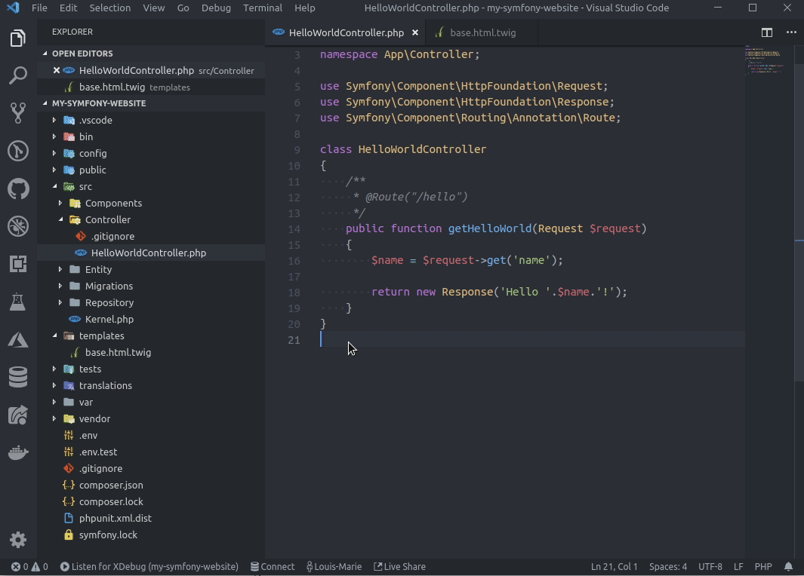
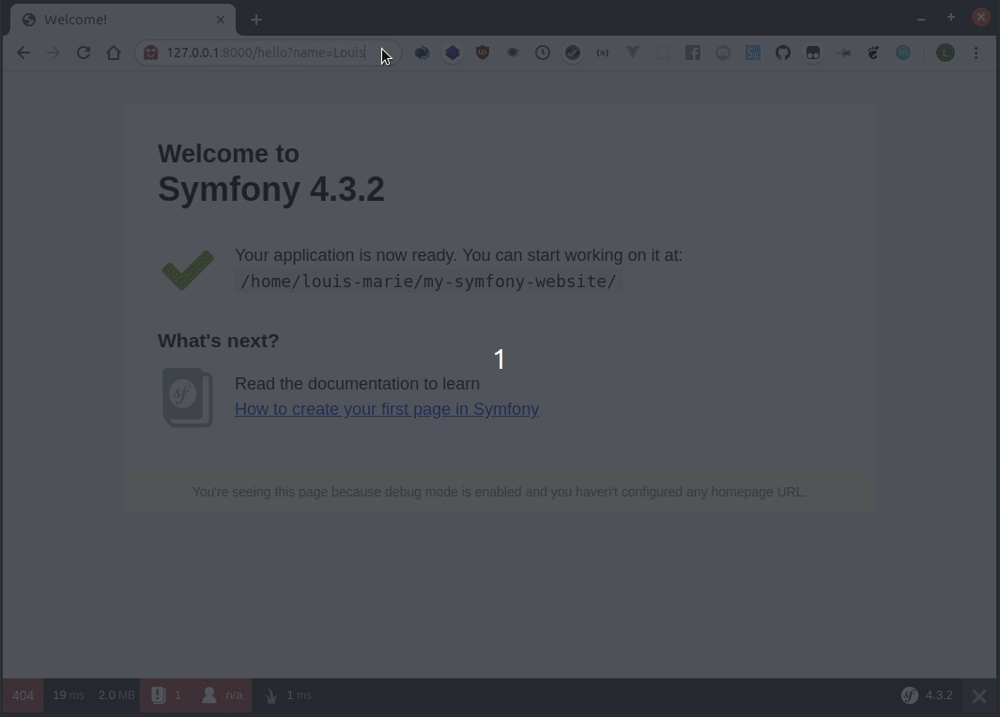
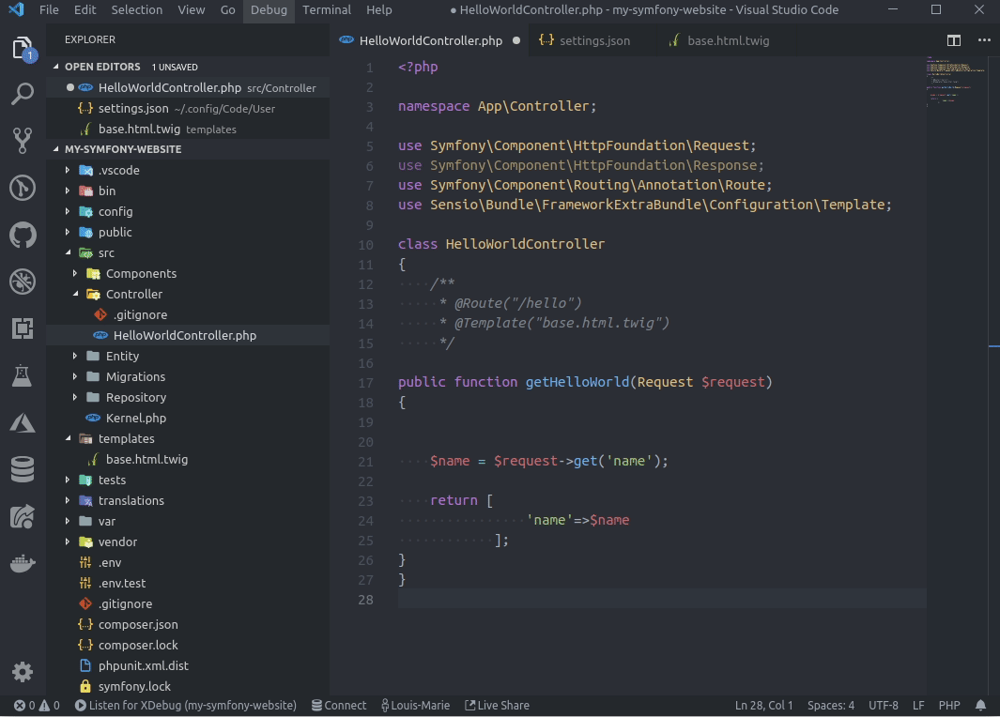

# Visual Studio Code For PHP Developers

 
<p align="center"></p>

###  Shortcuts

    Command Mode = Ctrl + Shift + p 
    Focuse on Explorer = ctrl + 0
    Move Selected Lines = alt + up / down
    Hide tree view = Ctrl + B 

    Explorer  = Ctrl + shift + E
    Version Control (Git)  = Ctrl + shift + v
    Serach = Ctrl + shift + f 
    Debuger = ctrl + shift + d
    Extentions  = Ctrl + shift + x

    Key Binding  = Ctrl + K + S 
    Setting = Ctrl + ,  
    Terminal = Ctrl + ~ 
    Go to Line = ctrl + G  | ctrl + p ---> type :
    Split Screen = Ctrl+\   (switch between them ctrl+1 , ctrl+2 , ...)

    Select current line = Ctrl+L
    Select All Occurrences of selected word = crtl + shift + L
    Select Match To Selected Text = Ctrl + d (for next one one again press ctrl + d)
    Multiple Cursor: alt + mouse left

    Next or Previous Method or Tag = ctrl + up arrow key Or down arrow key
    File All References = alt + shift + F12
    Go to Symbol in File = ctrl + shift + O  | | ctrl + p ---> type @
    Go to Symbol in Workspace = Ctrl + T
    Go to Implementation = ctrl + F12
    Peek = shift + F12

    Expand Selection =  Shift+Alt+Left or Shift+Alt+Right
    Code Folding = Ctrl+Shift+[ OR  Ctrl+Shift+]
    Line Height = crtl + ,  ---> search for line Height then -----> set to 40
    Open Markdown preview = Ctrl + Shift + V

    Duplicate Line Up = Ctrl + Alt + Shift + 8
    Duplicate Line Down : Ctrl + Alt + Shift + 2
    Delete Line: Ctrl + Shift + K 

    Code Formatting:
        Ubuntu = Ctrl + Shift + I
        Windows = Shift + Alt + F
        MacOS = Shift + Option + 

    Change Workspace = ctrl + r    

    List of all files open in an editor group: ctrl + tab
    Focus Breadcrumbs =  ctrl + shift + . 
    Bracket matching = Ctrl + Shift + \
    Switch to previous open file = ctrl + p + ctrl + p
    Open Reference = ctrl + shift + mouse left
    Goto Previous Edit point = ctrl + alt + -


### Settings

    - Enable auto save:  ctrl + ,  ---> search for auto save
    - Disable built-in PHP support:

        ` To disable the built-in PHP smart completions in favor of suggestions from an installed
          PHP extension, uncheck PHP > Suggest: Basic, which sets php.suggest.basic to false in your settings.json file. `
    - Open files in new tab = "workbench.editor.enablePreview": false
    - Hidden Menu Bar = ctrl + shift + p  ---> Toggle Menu Bar

### Debugging

#### Install Xdebug

    sudo apt install php-xdebug

Then run sudo nano /etc/php/7.2/mods-available/xdebug.ini and add the following lines:

    xdebug.remote_enable = 1
    xdebug.remote_autostart = 1
    xdebug.remote_host = x.x.x.x # for docker

#### Xdebug plugin

    felixfbecker.php-debug






#### Configure Xdebug to open file links with VS Code

 When you encounter an error, or when you use the Symfony debug toolbar or the profiler, you may want toopen the desired file directly in your IDE with the cursor at the corresponding line.

To be able to do that, you need to add the following line to your /etc/php/7.2/mods-available/xdebug.ini:

    xdebug.file_link_format = vscode://file/%f:%l

    xdebug.file_link_format = 'vscode://file/%f:%l&/path/to/app/in/docker/>/path/to/app/on/host/' # docker version




### PHP CS Fixer

    composer global require friendsofphp/php-cs-fixer


#### plugin

    junstyle.php-cs-fixer

#### settings

    "[php]": {
        "editor.defaultFormatter": "junstyle.php-cs-fixer",
        "editor.formatOnSave": true
    },



#### PHP CS Fixer config file

If you want to disable or enable some specific linting rules, you can do it in a .php_cs file at the root folder of your project. If this configuration file is present, VS Code takes it into account and overrides the configuration found in settings.json. You can find more information about the .php_cs file in the GitHub repository. A simple config file to use @PhpCsFixer category and disable some rules could be:


```php 
    <?php

    return PhpCsFixer\Config::create()
        ->setRules([
            '@PhpCsFixer' => true,
            'php_unit_internal_class' => false,
            'php_unit_test_class_requires_covers' => false,
        ])
    ;
```

#### In case of issues with format on save

Depending on your computer's speed, the length of your files and the number of rules you activate, linting a file on save can be slow, causing VS Code to refuse it. To fix this behavior, change the formatOnSaveTimeout in your settings.json:

    "editor.formatOnSaveTimeout": 5000,


### Tips and Tricks

##### Show List of Extentions

    $ code --list-extensions

##### Install Extention 

    $ code --install-extension <ext-name>

##### Install From File

    $ less extentions.txt | xargs -n 1 code --install-extension

### Awesome Plugins 

    adamvoss.vscode-languagetool
    amiralizadeh9480.laravel-extra-intellisense
    atlassian.atlascode
    austenc.tailwind-docs
    BernardXiong.env-vscode
    bmewburn.vscode-intelephense-client
    bradlc.vscode-tailwindcss
    calebporzio.better-phpunit
    damianbal.vs-phpclassgen
    donjayamanne.jquerysnippets
    eamodio.gitlens
    EdgardMessias.clipboard-manager
    Equinusocio.vsc-community-material-theme
    Equinusocio.vsc-material-theme
    equinusocio.vsc-material-theme-icons
    felixfbecker.php-debug
    formulahendry.auto-close-tag
    formulahendry.auto-rename-tag
    formulahendry.code-runner
    jakebathman.mysql-syntax
    liuji-jim.vue
    MehediDracula.php-constructor
    MehediDracula.php-namespace-resolver
    mikestead.dotenv
    mishkinf.goto-next-previous-member
    ms-azuretools.vscode-docker
    ms-vsliveshare.vsliveshare
    neilbrayfield.php-docblocker
    octref.vetur
    onecentlin.laravel-blade
    onecentlin.laravel5-snippets
    phproberto.vscode-php-getters-setters
    PKief.material-icon-theme
    redhat.vscode-yaml
    royaction.color-manager
    sandy081.todotasks
    sidharthachatterjee.vscode-tailwindcss
    sleistner.vscode-fileutils
    steoates.autoimport
    thisotherthing.vscode-todo-list
    vscode-icons-team.vscode-icons
    wushuaiBUAA.autocomplete-english-word
    ypresto.vscode-intelli-refactor    